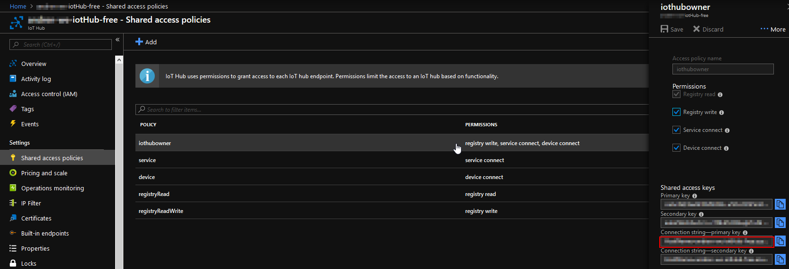
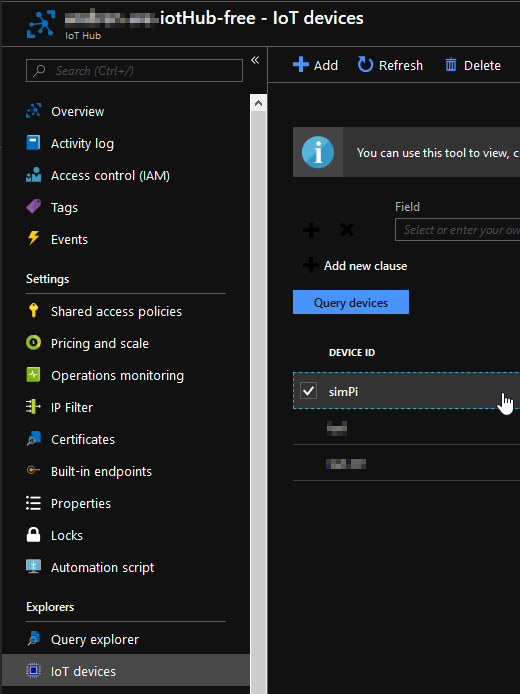

In Azure each resource has an associated resource key, it is what gives you access to a given resource so it should be carefully handled. It can be regenerated in case it is compromised.

Imagine you have a garage (IoT Hub) and several cars within it (devices). You need to have a garage key (to access it and add new cars), and then a single key for each car.
<!-- TODO: Add garage analogy pic -->

Thus in the context of Azure IoT, you have two kinds of keys:

- The **IoT Hub key** enables apps to manage the IoT Hub (add/remove devices, check which and how many devices it has, monitor/send messages, ...), just like the VS Code extension we are going to use. The Hub key looks something like: ```HostName=<your_hub_name>.azure-devices.net;SharedAccessKeyName=iothubowner;SharedAccessKey=__________=```

You will find it here, and this key is what you need to paste in VS Code:




- The **device key** is the unique identifier for each device. It looks like this:
```HostName=<your_hub_name>.azure-devices.net;DeviceId=<your_device_name>;SharedAccessKey=__________=```

**You can get it from VS Code (as shown later in the workshop)** or, in the Azure Portal you will find it after creating a device called *simPi* for example:

**NOTE:** You can quickly distinguish between these two types keys by checking if there is a *DeviceId* (device key) or *SharedAccessKeyName* (IoT Hub key) property in the middle of the string.

